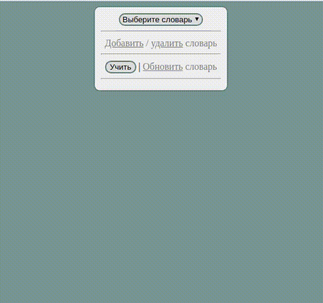

# VocReminder

It handles custom dictionaries and asks user to fill translations in order to remember them.

## Draft

Нужно прописать сценарии для:
- [ ] обучения под кнопкой «Учить»
- [ ] обновления и редактирования облака переводов под ссылкой «Обновить словарь»
