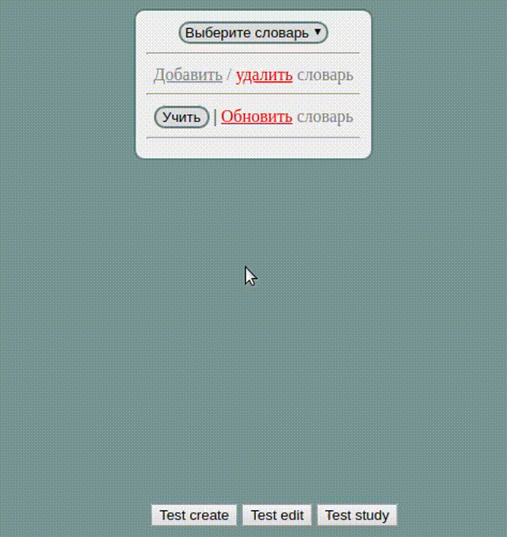

# VocReminder

It handles custom dictionaries and asks user to fill translations in order to remember them.

## Development steps

### First draft (add ui design)

### Second draft (add dictionaries' editing feature + visual ui testing)

### Third final version (add sudying feature)

## Draft

Нужно прописать сценарии для:
- [x] обучения под кнопкой «Учить»
- [x] обновления и редактирования облака переводов под ссылкой «Обновить словарь»
